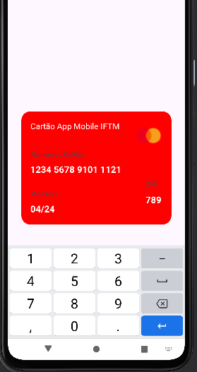

<h1 align="center">Cartão</h1>

## Project

Credit card interface in Android Studio, using the Kotlin programming language with automatic formatting in the card number field.
## Layout
<div align="center">
  
</div>

## Technologies Used
- *Programming Language:* Kotlin
- *Development Environment:* Android Studio

## Code Author
```kotlin
fun main() {
    println("Code by Marcela Geremias!")
}